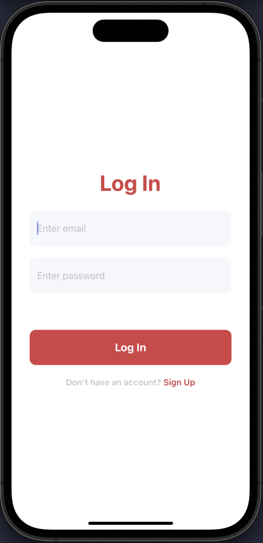
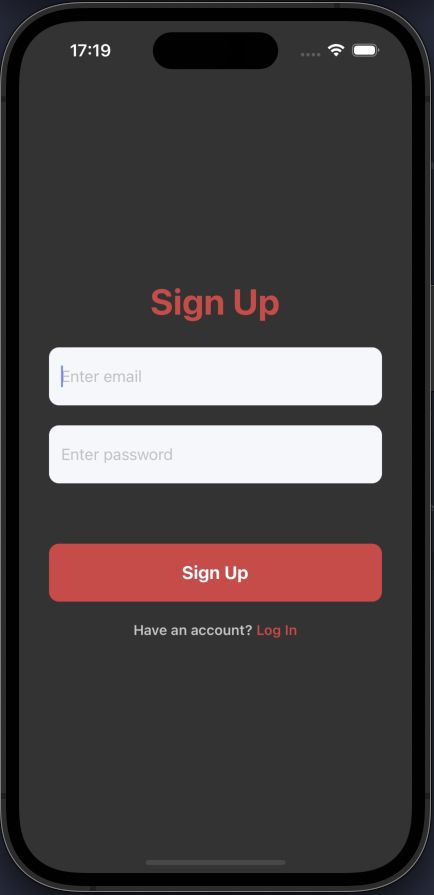
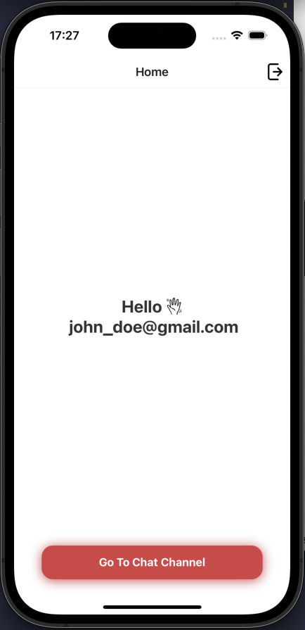
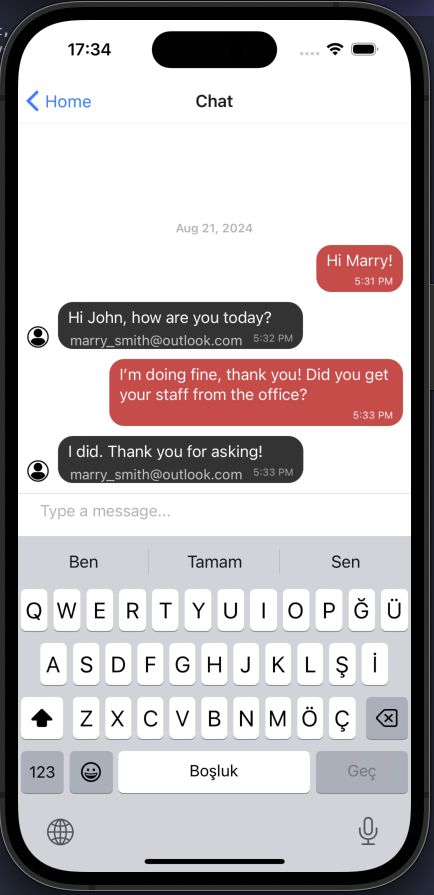

# RN_MESSAGING_APP

- This is a new [**React Native**](https://reactnative.dev) project, bootstrapped using [`@react-native-community/cli`](https://github.com/react-native-community/cli).
- This app utilizes firebase authentication and database services to realize the functionality it aims to provide.
- The app consists of two main features. Signin/signup and sending/receiving messages via a chat channel.

## How to run the project locally?

> **Note**: Make sure you have completed the [React Native - Environment Setup](https://reactnative.dev/docs/environment-setup) instructions till "Creating a new application" step, before proceeding. Basically, you need to have all necessary tools installed in your computer to run a react-native project.

### Step 1: Provide a .env file with valid credentials

First, you need to create a **.env** file which contains all the necessary _credentials_ for Firebase. This file should be existed at the _root_ of the project.

```js
API_KEY=
AUTH_DOMAIN=
PROJECT_ID=
STORAGE_BUCKET=
MESSAGING_SENDER_ID=
APP_ID=
```

If you would like to work with your own database, you should create a new project from Firebase, enable email-password authentication and create a Firestore database. After that, you should fill the below env variables with values that provided by Firebase.

### Step 2: Start your Application

Run the following command to install packages:

```bash
npm install
```

Run the following command to start your _Android_ or _iOS_ app:

```bash
npm run ios

npm run android
```

If everything is set up _correctly_, you should see your new app running in your _Android Emulator_ or _iOS Simulator_ shortly provided you have set up your emulator/simulator correctly.

This is one way to run your app — you can also run it directly from within Android Studio and Xcode respectively.

Notice: I already configured automatic pod installation, therefore running `npm run [platform]` should be enough. But for some reason, if you have any trouble in build step due to pods, please run `npx pod-install ios` before running the actual command.

## Screens and Features

#### Log In and Sign Up Screens

The app features a streamlined authentication process with two main screens:

- **Log In:** This is where returning users can log in to the app. If you already have an account, simply enter your credentials and tap "Log In" to access the app.



- **Sign Up:** If you're new to the app, you can create a new account by navigating to the Sign Up screen. Here, you'll be asked to provide the necessary information to register. Once you've signed up, you can then use the Sign In screen to log in.



Navigating between these screens is easy. If you don't have an account yet, the Sign In screen provides a quick link to the Sign Up screen. Similarly, if you're on the Sign Up screen but already have an account, you can switch back to the Sign In screen with a single tap.

#### After Login: Homepage

Once logged in, users are redirected to the **Homepage**, which provides a friendly and functional interface:

- **Sign Out Icon:** Located at the top right corner, this icon allows users to log out of their accounts with a single tap.

- **Welcoming Text:** A personalized greeting message welcomes the user, displaying the logged-in user's email address to confirm their identity.

- **Navigate to Chat Screen:** At the bottom of the homepage, a button is available for users to navigate to the chat screen, where they can send and receive messages.



#### Chat Screen

The **Chat Screen** allows users to engage in real-time messaging:

- **Real-Time Messaging:** Users can send and receive messages instantly, facilitating seamless communication.

- **Message Details:** Each message displays the time it was sent and the email of the user who sent it, providing context and clarity to the conversation.


